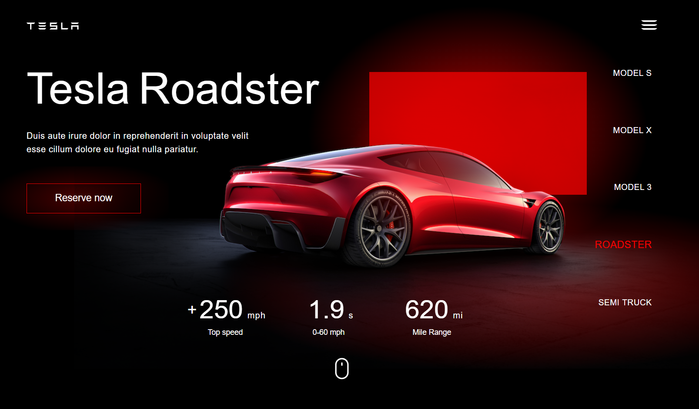
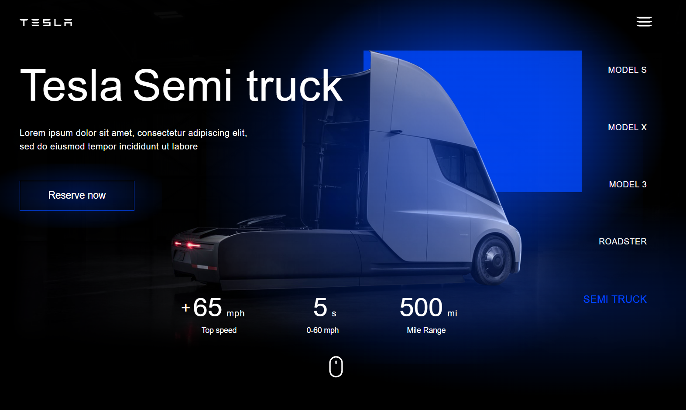

<h1 align="center">🚗 𝓣𝓮𝓼𝓵𝓪 𝓛𝓪𝓷𝓭𝓲𝓷𝓰 𝓟𝓪𝓰𝓮 🌟</h1>

  A modern, responsive, and visually appealing landing page inspired by Tesla's official website, built using <strong>HTML</strong>, <strong>CSS</strong>, and <strong>JavaScript</strong>.

  

  <a href="https://abhaykatre70.github.io/Tesla-Landing-Page/" target="_blank">
    <strong>🔗 Live Project</strong>
  </a>

  
  
  
  

---

<h2>🛠️ 𝓣𝓮𝓬𝓱𝓷𝓸𝓵𝓸𝓰𝓲𝓮𝓼 𝓤𝓼𝓮𝓭</h2>
<ul>
  <li><strong>HTML5</strong> – Semantic markup for structure</li>
  <li><strong>CSS3</strong> – Styling, layout, and responsive design</li>
  <li><strong>JavaScript</strong> – Interactive features and animations</li>
  <li><strong>Git & GitHub</strong> – Version control and deployment</li>
</ul>

---

<h2>📂 𝓟𝓻𝓸𝓳𝓮𝓬𝓽 𝓢𝓽𝓻𝓾𝓬𝓽𝓾𝓻𝓮</h2>
<pre>
Tesla-Landing-Page/
├── index.html       # Main HTML file
├── style.css        # Styling and layout
├── script.js        # Interactive JavaScript
├── screenshots/     # Project screenshots
└── README.md        # Project documentation
</pre>

---

<h2>🚀 𝓖𝓮𝓽𝓽𝓲𝓷𝓰 𝓢𝓽𝓪𝓻𝓽𝓮𝓭</h2>

Follow these steps to run the project locally:

<ol>
  <li><strong>Clone the repository:</strong>
    <pre>git clone https://github.com/abhaykatre70/Tesla-Landing-Page.git</pre>
  </li>
  <li><strong>Navigate into the project directory:</strong>
    <pre>cd Tesla-Landing-Page</pre>
  </li>
  <li><strong>Open <code>index.html</code></strong> in your web browser.</li>
</ol>

---

<h2>🎨 𝓕𝓮𝓪𝓽𝓾𝓻𝓮𝓼</h2>
<ul>
  <li>Fully responsive design compatible with mobile, tablet, and desktop screens</li>
  <li>Clean and modern user interface</li>
  <li>Interactive navigation menu and buttons</li>
  <li>Sectioned layout for easy readability</li>
</ul>

---

<h2>📌 𝓢𝓬𝓻𝓮𝓮𝓷𝓼𝓱𝓸𝓽𝓼</h2>

Here is a preview of the Tesla Landing Page:

  
  

---

<h2>💡 𝓕𝓾𝓽𝓾𝓻𝓮 𝓔𝓷𝓱𝓪𝓷𝓬𝓮𝓶𝓮𝓷𝓽𝓼</h2>
<ul>
  <li>Add animations to sections for a more dynamic experience</li>
  <li>Integrate a contact form for user interaction</li>
  <li>Optimize for faster page load and performance</li>
</ul>

---

<h2>📄 𝓛𝓲𝓬𝓮𝓷𝓼𝓮</h2>

This project is open-source and available under the <a href="#">MIT License</a>.

---

Developed with ❤️ by <strong>Abhay Katre</strong>

